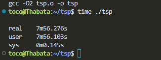
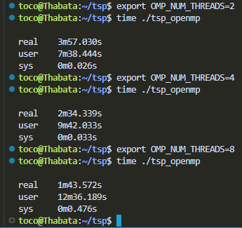
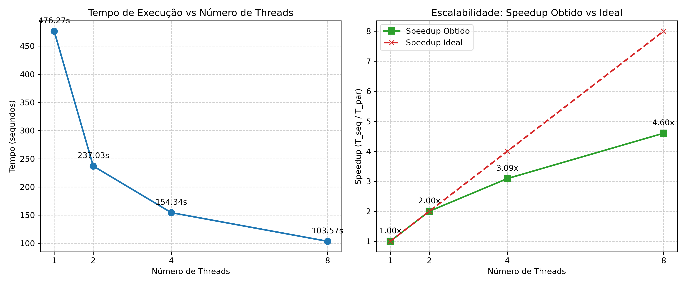

# Relatório de Paralelização - Problema do Caixeiro Viajante (TSP)

**Instituição:** Ciência da Computação - IGCE/Unesp

**Grupo 8 (Traveling Salesman Problem):**
* Thabata Santana
* Renan Alves
* Kauã Nylander

## 1. Introdução e Descrição do Problema
O Problema do Caixeiro Viajante (TSP - *Traveling Salesman Problem*) é um desafio clássico na área da computação, conhecido por sua alta complexidade e por ser extremamente pesado para o processador (*CPU-bound*) Dada uma lista de cidades e a distância entre os pares, o objetivo da aplicação é encontrar o menor caminho possível que visite cada cidade exatamente uma vez e retorne ao ponto de partida.

## 2. Análise da Aplicação Sequencial
O código sequencial fornecido como ponto de partida utiliza uma abordagem de busca recursiva para explorar os caminhos possíveis. Ao analisar o funcionamento do algoritmo, nosso grupo notou dois pontos principais de atenção para o desempenho:
* **Poda da Árvore (*Pruning*):** Existe uma verificação na recursão (`if (shortest < distance)`) que interrompe imediatamente a busca se a rota atual já estiver mais longa do que o melhor caminho encontrado até o momento[cite: 2]. Isso economiza muito tempo, mas faz com que o peso do processamento seja muito imprevisível dependendo de qual cidade começamos.
* **Laço Principal:** Na função `main`, um laço `for` itera sobre cada uma das cidades do grafo, definindo-a como o vértice de origem da rota e disparando a busca a partir dela.

## 3. Estratégia de Paralelização
Nós decidimos utilizar a biblioteca **OpenMP** para este projeto. Como o ambiente alvo avalia o ganho de desempenho pela divisão do tempo sequencial pelo tempo paralelo, o OpenMP se mostrou a ferramenta mais prática para atuar em arquitetura de memória compartilhada, exigindo menos refatoração bruta do código original.

Focamos nossa estratégia na "granulação grossa", paralelizando o laço principal da função `main` para que cada *thread* assuma a busca a partir de uma cidade inicial diferente, explorando a árvore de forma simultânea[cite: 2]. 

**Desafios e Soluções na Implementação:**
* **Condição de Corrida (*Race Condition*) na Matriz de Visitas:** No código original, o vetor `ok` que marcava as cidades visitadas era global. Se apenas colocássemos a diretiva `#pragma omp parallel for`, todas as *threads* escreveriam no mesmo vetor simultaneamente, quebrando a corretude do resultado. A solução foi criar um vetor isolado (`local_ok`) dentro da região paralela para que cada *thread* tivesse seu próprio estado de memória.
* **Sincronização da Menor Rota:** A variável `D`, que guarda a menor distância global, precisa ser lida e atualizada por todas as *threads*. Para evitar que duas *threads* sobrescrevessem o valor ao mesmo tempo gerando inconsistências, colocamos a atualização final de `D` dentro de uma região de exclusão mútua com `#pragma omp critical`.
* **Balanceamento de Carga:** Por causa do algoritmo de poda (*pruning*), algumas cidades terminam suas buscas muito antes de outras. Para que as *threads* não ficassem ociosas esperando as demais terminarem, adicionamos a cláusula `schedule(dynamic)`, fazendo com que *threads* livres puxem dinamicamente novas cidades da fila de iteração.

## 4. Ambiente de Testes
Para a avaliação de desempenho e medição dos tempos de execução, os testes foram realizados localmente. Lembrando que a capacidade física do processador explica diretamente o limite do ganho de velocidade que conseguimos alcançar com as *threads*:

* **Sistema Operacional:** Windows Subsystem for Linux (WSL)
* **Processador:** AMD Ryzen 5 3500U (2.10 GHz) - 4 Núcleos Físicos / 8 Núcleos Lógicos (SMT)
* **Memória RAM:** 8 GB
* **Compilador:** GCC com flags de otimização `-O2` e `-fopenmp`

## 5. Avaliação e Ganhos de Desempenho (Speedups)
Os testes foram realizados utilizando o arquivo de entrada com 15 cidades fornecido para o problema. Para as medições, utilizamos o comando `time` nativo do Linux, considerando o tempo real de CPU ("tempo de relógio").

A tabela abaixo resume os tempos obtidos e o *speedup* calculado para cada cenário:

| Número de Threads | Tempo de Execução (s) | Speedup Obtido (T_seq / T_par) |
| :---: | :---: | :---: |
| 1 (Sequencial Base) | 476,27 | 1.00x |
| 2 Threads | 237,03 | 2.00x |
| 4 Threads | 154,34 | 3.09x |
| 8 Threads | 103,57 | 4.60x |

### Discussão dos Resultados e Escalabilidade
A versão paralela implementada com OpenMP garantiu a corretude do resultado em todas as execuções, encontrando com sucesso a mesma rota mínima da versão sequencial.

Ao avaliarmos os ganhos de desempenho, observamos um *speedup* perfeito e linear ao utilizarmos 2 *threads* (2.00x), reduzindo o tempo total de quase 8 minutos para menos de 4 minutos. No entanto, ao escalarmos para 4 e 8 *threads*, notamos uma queda na eficiência paralela, alcançando *speedups* sublineares de 3.09x e 4.60x, respectivamente.

Identificamos que esse comportamento limitante ocorreu por três motivos principais atrelados à arquitetura do código e ao nosso hardware de testes:
1. **Região Crítica:** O uso do `#pragma omp critical` cria um gargalo de sincronização, pois as *threads* precisam competir pelo acesso exclusivo na hora de verificar e atualizar a menor rota encontrada.
2. **Corte da Árvore de Busca:** Mesmo utilizando o escalonamento dinâmico, nas execuções com mais *threads*, o *overhead* de gerenciar as filas de tarefas e o peso muito desigual das ramificações finais impediram um ganho perfeitamente proporcional.
3. **Limitação de Hardware (Cores Físicos):** Como o processador AMD Ryzen 5 3500U utilizado nos testes possui apenas 4 núcleos físicos dedicados, o sistema atinge seu pico natural de eficiência real na faixa das 4 *threads*. Ao utilizar 8 *threads*, o processador recorre ao SMT (*Simultaneous Multithreading*) para dividir os mesmos 4 núcleos físicos, o que justifica totalmente a desaceleração na evolução do *speedup* nessa última etapa do teste empírico.

Apesar das limitações do hardware, a redução do tempo total para apenas 1 minuto e 43 segundos (com 8 *threads*) comprova que a estratégia adotada pelo grupo cumpriu com sucesso os requisitos do desafio.